# Gradient Theme

English | [中文文档](./README-zh.md)

[Current repository link](https://github.com/shaobeichen/gradient-theme). If you like it, please give it a star!

# Warning

Although the warning will not affect any functionality, If you are very concerned about the VSCode "corrupted" warning prompt, **it is not recommended** to use this theme.

If you do not want to ignore the "corrupted" warning prompt, please consider carefully whether to use this theme.

To be honest, I was very mind at first, but after I ignored the "corrupted" warning prompt, I no longer cared.

# Themes

<table>
    <tr>
        <td>
            <b>Gradient Bearded Theme Arc</b>
            
I added a gradient effect to in <a href="https://marketplace.visualstudio.com/items?itemName=BeardedBear.beardedtheme">Bearded Theme Arc</a> .

        </td> 
        <td>
            <b>Gradient Dracula Theme</b>
            
I added a gradient effect to in <a href="https://marketplace.visualstudio.com/items?itemName=dracula-theme.theme-dracula">Dracula Theme</a> .

        </td> 
    </tr>
    <tr>
        <td>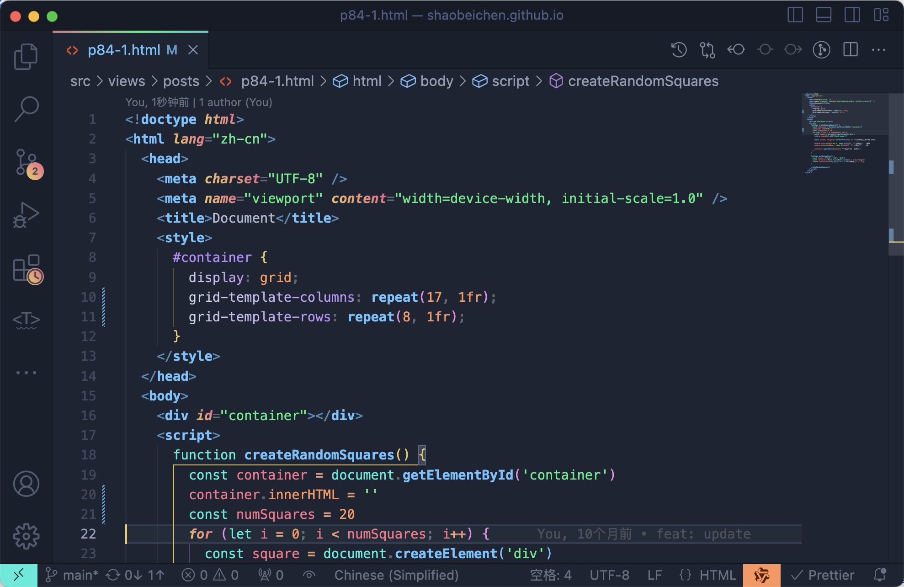</td>
        <td>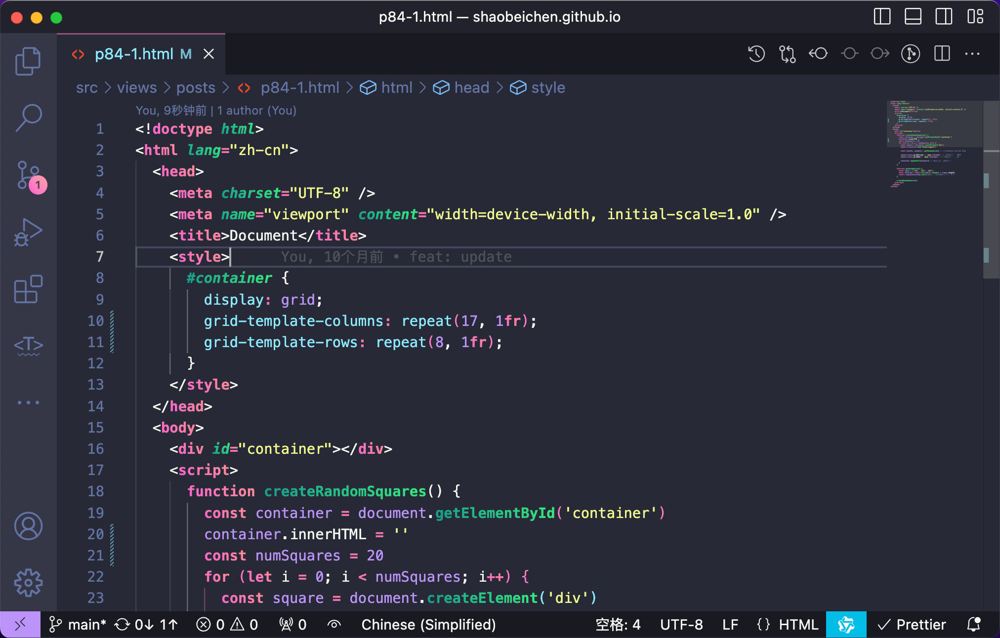</td>
    </tr>
    <tr>
        <td>
            <b>Gradient Monokai Pro</b>
            
I added a gradient effect to in <a href="https://marketplace.visualstudio.com/items?itemName=monokai.theme-monokai-pro-vscode">Monokai Pro</a> .

        </td> 
        <td>
            <b>Gradient Monokai Pro Classic</b>
            
I added a gradient effect to in <a href="https://marketplace.visualstudio.com/items?itemName=monokai.theme-monokai-pro-vscode">Monokai Pro Classic</a> .

        </td> 
    </tr>
    <tr>
        <td>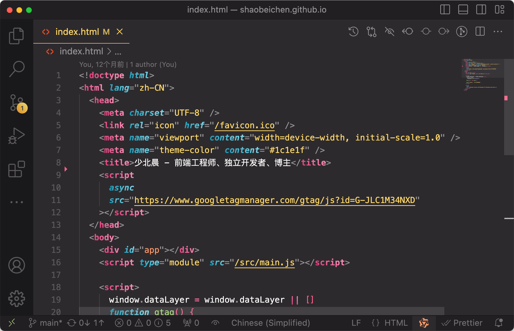</td>
        <td></td>
    </tr>
    <tr>
        <td>
            <b>Gradient Modern Dark</b>
            
I added a gradient effect to in <a href="">Modern Dark</a> .

        </td>
        <td>
            <b>Gradient Atom One Dark</b>
            
I added a gradient effect to in <a href="https://marketplace.visualstudio.com/items?itemName=akamud.vscode-theme-onedark">Atom One Dark</a> .

        </td>
    </tr>
    <tr>
        <td>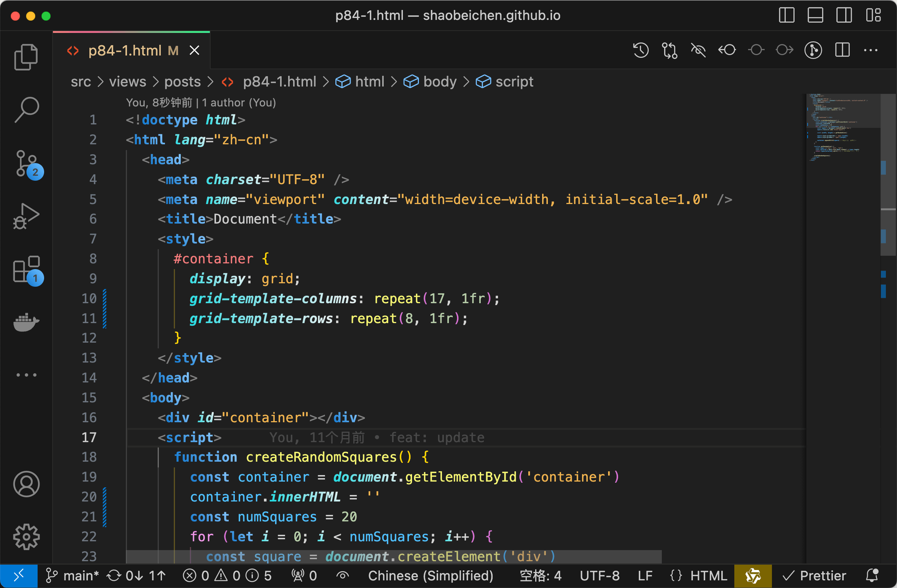</td>
        <td></td>
    </tr>
    <tr>
        <td>
            <b>Gradient Developer Theme Firefox Dark</b>
            
I added a gradient effect to in <a href="">Developer Theme</a> .（Private paid customization is not available to the public）

        </td> 
         <td>
            <b>Gradient Bearded Theme Arc Woodfishhhh</b>
            
We added a gradient and glow effect to in <a href="https://marketplace.visualstudio.com/items?itemName=BeardedBear.beardedtheme">Bearded Theme Arc</a> . Thanks for <a href="https://github.com/woodfishhhh">woodfishhhh</a> 's PR. 

        </td>  
    </tr>
    <tr>
        <td>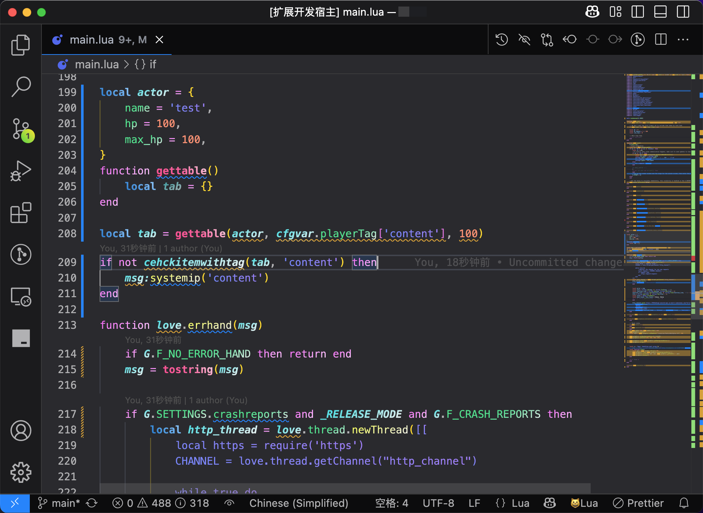</td>
        <td>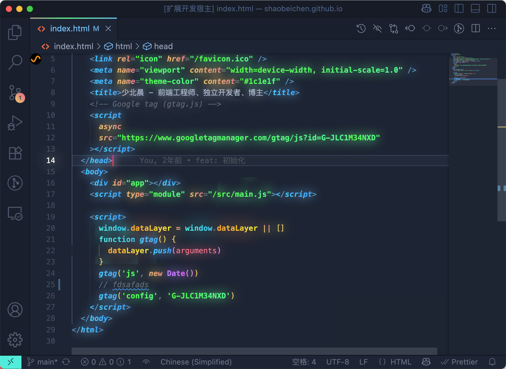</td>
    </tr>
</table>

# Inspiration

One day, I saw a video where someone modified the VSCode theme's CSS file themselves.

So I thought I could use the same method to create a VSCode gradient effect CSS file,

Then I started using Custom CSS and JS Loader plugin to load the custom gradient CSS,

Later, many people thought my gradient theme was very beautiful and wanted to use it on their own VSCode,

But to use it, they needed to install a plugin and I had to give them a CSS file, which was too troublesome!

So I learned how to make a VSCode theme plugin and made this gradient theme plugin.

# Installation

- Install the theme from the [VSCode Marketplace](https://marketplace.visualstudio.com/items?itemName=shaobeichen.gradient-theme).

  Or

- Search for Gradient Theme or gradient-theme in VSCode and install it.

After installation, you can choose the base theme, **there is no gradient effect at this time**, if you want to enable the gradient effect, please see the next step.

**Why isn't the gradient effect enabled directly?**

Because enabling the gradient effect will modify the core files of VSCode, which will be interpreted as "corrupted" by VSCode, and you may see a warning prompt when restarting the editor, but you can safely ignore this message.

If you don't want to ignore the warning prompt, please consider carefully whether to use this theme.

# Gradient Effects

### Enable Gradient

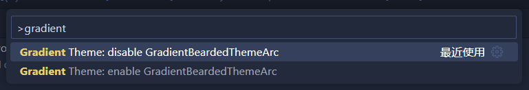

You can enable it by pressing `Ctrl + Shift + P` or `Shift + ⌘ + P` and selecting "**Gradient Theme: Enable Gradient**".

### Disable Gradient

You can disable it by pressing `Ctrl + Shift + P` or `Shift + ⌘ + P` and selecting "**Gradient Theme: Disable Gradient**".

### Restart Editor

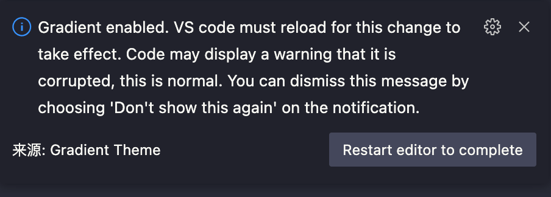

After enabling or disabling the gradient effect, there will be a prompt, click to restart the editor to see the gradient effect.

# Custom Theme

When you feel that the current gradient theme effect is not good, you can customize the gradient theme yourself.

Please note that if you have enabled custom gradient effects, regardless of which theme you switch to, the gradient effects will be displayed as your own.

At present, the first version of the custom theme function is simple, and it will be further improved in the future.

### Customized theme video teaching url

https://www.bilibili.com/video/BV1FemxYYEAv

#### 1. Open Settings

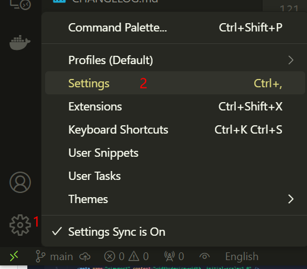

#### 2. Find gradient theme settings

Open the settings, search for 'gradient css', find' Gradient Theme: CSS', and click on 'edit in settings. json'.

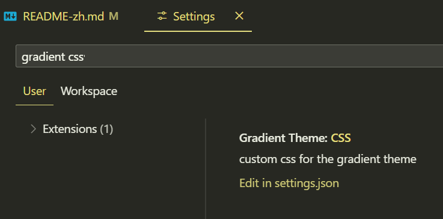

#### 3. Add custom gradient style

Add custom CSS, array types, and support for writing multiple gradient styles in seting.json, but only one will take effect` 'enable' means true to enable this custom gradient theme CSS, 'false' means off, and 'css' means the content of the custom gradient theme CSS.

Note that CSS needs to be compressed into one line. The compression method can refer to [Online Compression Tool]（ https://tool.chinaz.com/tools/cssformat.aspx ）.

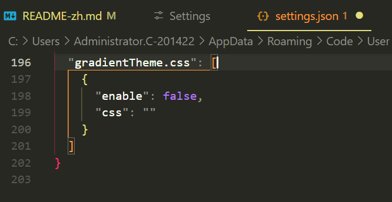

#### 4. Enable gradient and restart the editor

After writing CSS, you need to manually enable gradient and restart the editor. The method of enabling gradients is mentioned above in the document.

# Please Note

### 1. Ignore the "Corrupted" Warning Prompt

Please note that since enabling the gradient effect modifies the core files of VSCode, VSCode will interpret it as a "corrupted" core file, and you may see a warning prompt when restarting the editor, which you can safely ignore.

If you do not want to ignore the warning prompt, please consider carefully whether to use this theme.

### 2. Execute Enable command, prompt no permission

If you are a Windows user, you may need to run VS Code with administrator privileges. For Linux and Mac users, Code must not be installed in a read-only location and you must have write permissions.

# Compatibility

This theme is still being updated and optimized. I mainly use HTML, CSS, JS, TS, Vue, React, etc. for development, so although these languages and frameworks look good, other languages and frameworks may not be suitable for the theme. If you find any obvious problems, you can raise an issue, and I will resolve it as soon as possible.

# How to Contribute

I'm glad you're interested in this theme, and any suitable contribution is welcome.

1. Fork and Clone this repository `git clone https://github.com/<YOUR-USERNAME>/gradient-theme`
2. Create a branch for your changes `git checkout -b my-new-feature`
3. Open the _gradient-theme_ folder in VSCode
4. Modify the files you want to change
5. Use F5 in VSCode to preview the debug
6. Commit and Push your changes
7. Submit a PR, please note that not all suggestions can be accepted

# Thanks

Thanks to Lun Dev for inspiring me to create this gradient theme. 🙏

**[Lun Dev](https://www.youtube.com/@lundeveloper)**

Thanks to the authors of the following themes for their contributions to open source. 🙏 I made gradient effects for each theme based on the following themes.

**[Bearded Theme](https://marketplace.visualstudio.com/items?itemName=BeardedBear.beardedtheme)**

**[Dracula Theme Official](https://marketplace.visualstudio.com/items?itemName=dracula-theme.theme-dracula)**

**[Monokai Pro](https://marketplace.visualstudio.com/items?itemName=monokai.theme-monokai-pro-vscode)**

**[Monokai Pro Classic](https://marketplace.visualstudio.com/items?itemName=monokai.theme-monokai-pro-vscode)**

**[Atom One Dark](https://marketplace.visualstudio.com/items?itemName=akamud.vscode-theme-onedark)**
